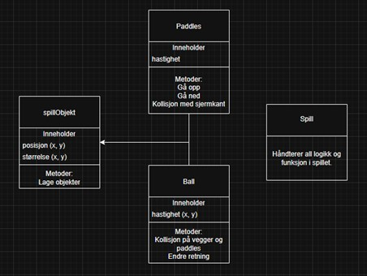

# Pong

## Beskrivelse
Vi skal gjenskape spillet **Pong** med **Pygame** og ved bruk av **objektorientert programmering**.

---

## Funksjonalitet
- Ball som beveger automatisk  
- To plattformer/paddles  
- Ball spretter når den treffer:
  - Plattform/paddle  
  - Tak  
  - Gulv  
- Poeng til motspiller hvis ballen går ut på sin egen side  

---

## Bevegelse
- **Venstre spiller**
  - Opp: `W`
  - Ned: `S`
- **Høyre spiller**
  - Opp: `Pil opp`
  - Ned: `Pil ned`

---

## Poengsystem
- Vis poeng for begge spillerne  
- Oppdater poeng når ballen går ut  
- Når ballen går ut:
  - Reset ballen til midten  
- Spiller vinner etter **11 poeng**  
- Poeng resettes etter seier  

---

## Klassediagram

